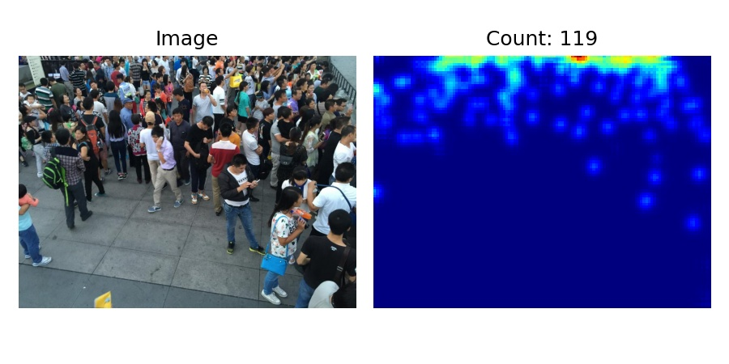
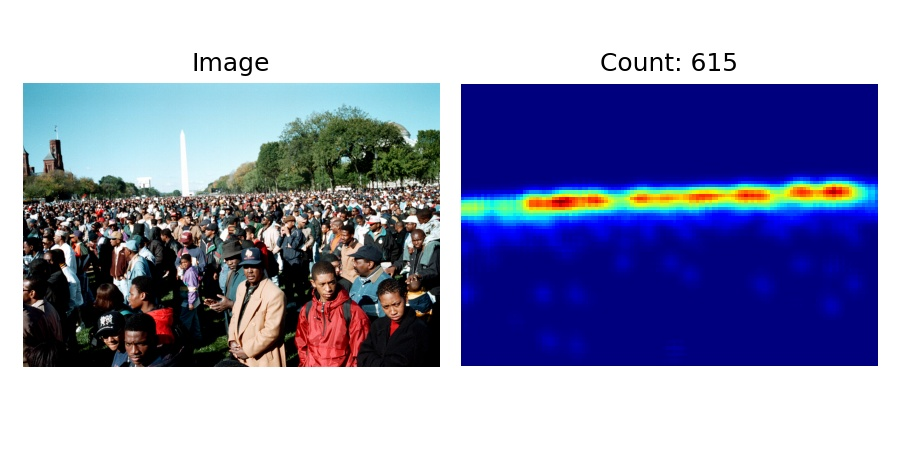

# Crowd Counting using Density Estimation

This is a demo project showing how to train a crowd counting model using PyTorch framework.

## Training
Clone this repository:

    `git clone https://github.com/muasifk/crowd-density-estimation.git`

Change the path to the training data in `src.train.py`.

Start training.

    `python train.py`

## Inference
Define the path to the test images, or change the url of the image in `predict.py`.

    `python predict.py`

## Sample Results

<!--  -->

# Author:
> Muhammad Asif Khan < asifk@ieee.org >
